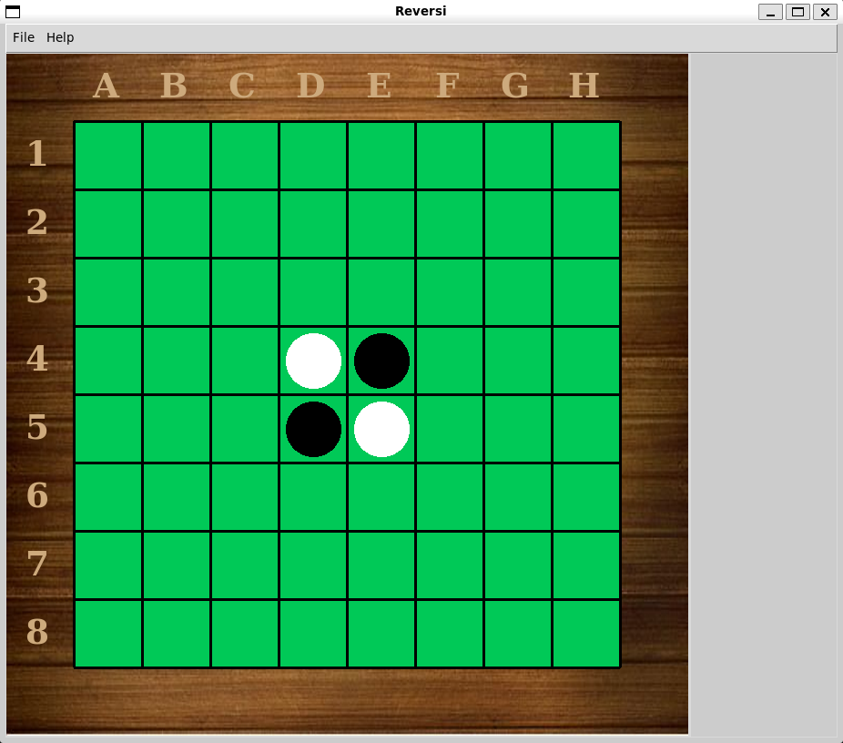

# Reversi - A personal project for the game Reversi with an AI agent

# Creator
    - Ofer Ravid

## Files
- main.py - The main file for the project. Contains the main function that runs
            the game and gui.

- GUI:
  - graphics.py - This file defines the graphic interface using tkinter. Contains the
                  classes: Point, Line, Disk, Window, Board.

- Game:
  - game.py - This file defines the Game class, the Player class and AIPlayer class.
              Together those classes run the game.
              Player is the base class for all player classes and is in charge of
              handling the human players.
              The AIPlayer is a generic class that all the AI agents we want to create
              can inherit from.

  - util.py - This file defines constants and helper functions for the game.

- AI_Players:
  - ai_players.py -   This file defines the AI agents for the game.
    - RandomPlayer - AI agent that plays moves randomly.
    - GreedyPlayer - AI agent that plays moves by finding the move that
                     guaranties capturing the most disks.
    - MCTSPlayer - AI agent that finds a move using the Monte Carlo Tree
                   Search algorithm.
    - MinimaxPlayer - AI agent that finds a move using the Min-Max
                      algorithm with Alpha-Beta pruning.

  - ai_helper.py - This file defines the MCTS and Min-Max algorithms and other helper
                   functions for the AI players.

- tests.py - This file handles unit testing.

- openings_book.txt -   A table of known openings and their common names.
                        The AI players use that book at the start of the game.

- imgs -    A folder for all the images needed for the game.

---

# Plans for the future

- Make the gui window resizable with all canvas' elements or figure out how to
  fix the resizable(False, False) method to disable resizing completely.

- Make the MCTS and Minimax agents faster.

- Optional: remember old games and use them to teach an AI player to find the
  best move based on old experience.

---

# How to play

Using Python 3+ run:

`python main.py`

Or...

Using docker:

Build container:  
`docker build -t reversi .`  

Run:  
`docker run -i -t --rm -e DISPLAY=$DISPLAY -v /tmp/.X11-unix:/tmp/.X11-unix --mount source=Saved_games,target=/usr/src/app/Saved_games reversi`

This will open the game's window.\
Use the menubar to navigate and choose how you want to start playing.

---

###### Here's a demo with RandomPlayer and GreedyPlayer:

># ***Have fun!***