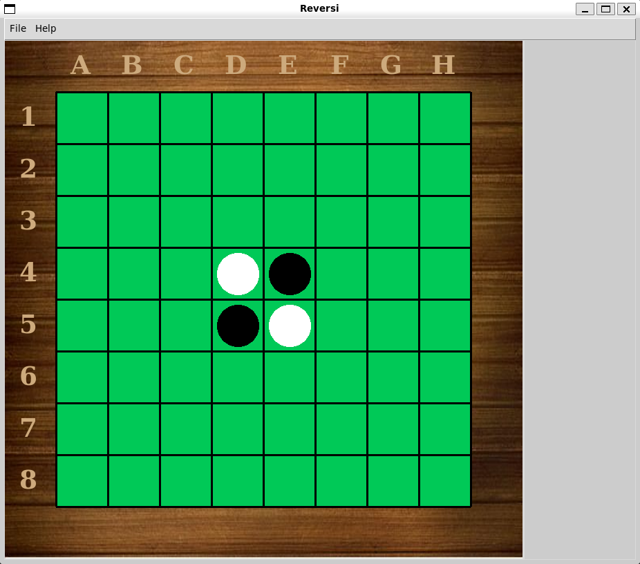

# Reversi - A personal project for the game Reversi with an AI agent

# Author
    - Ofer Ravid

# Files
    - main.py - The main file for the project. Contains the main function that runs the game and gui.
    - graphics.py - This file defines the graphic interface using tkinter. Contains the
                    classes: Point, Line, Disk, Window, Board.
    - game.py - This file defines the Game class, the Player class and AIPlayer class.
                Together those classes run the game.
                The AIPlayer is a generic class that all the AI agents we want to create can inherit from.